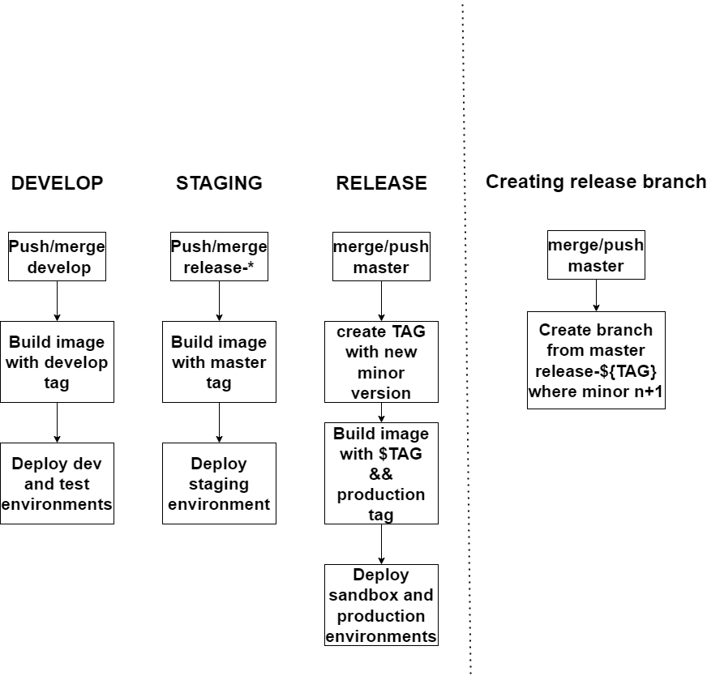

# github-workflows
Reusable Workflows

Сopy this code to workflow.yml in the repository calling workflow

```
name: Init workflow Test Release and Deploy

on:
  push:
    branches:
      - master
      - develop
      - release-*
  pull_request:
    branches:
      - master
      - develop   
  create:
    tags:
       - '**'     

jobs:
  call-workflow-test:
    uses: alexisapp/alexis-github-workflows/.github/workflows/test.yaml@master
    secrets: inherit
    with:
      MONGODB_URI: mongodb://localhost:27017/test_
      MONGODB_DBNAME: alexis_$APP_NAME
      ID_URL: http://localhost:3002
      API_URL: http://localhost:3000
      PORT: "3047"
      runs-on: 'ubuntu-latest'
      get_actions_user_id: false
      correct_ownership: false
      node_version: '16'
      set_npm: true
      cache: true
      unset_prepare: true
      publish_code_coverage: true
      coverage_files: "./coverage/clover.xml"
      coverageLocations: "/coverage/lcov.info:lcov"
      dockercompose: false
      npm_tests: true
      dockercompose_wth_tests: false
      mongodb: true
      upload_code_coverage: true
      run_test_server: false
      run_test_e2e: false

  call-workflow-sentry:
    if: |
        contains('
          refs/heads/develop
          refs/heads/master
        ', github.ref)    
    uses: alexisapp/alexis-github-workflows/.github/workflows/sentry.yml@master
    secrets: inherit
    with:
     outdir: dist  # Can be build

  call-workflow-deploy:
    if: |
        contains('
          refs/heads/develop
          refs/heads/master
        ', github.ref) || 
        startsWith(github.ref, 'refs/heads/release-')
    uses: alexisapp/alexis-github-workflows/.github/workflows/build_and_deploy_image.yaml@master
    secrets: inherit
    with:
      dockerfile_name: "prod.Dockerfile"
      migrations: false
      workers: false
```  
# Microservices deployment strategy

<p align="center" width="100%">
    
</p>

